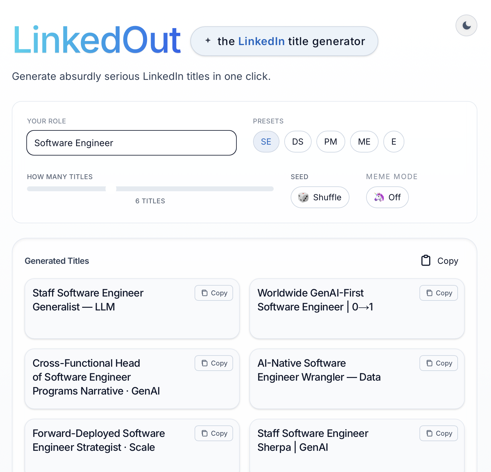

# LinkedOut ✨

An absurdly serious, deterministic title generator that turns your role into LinkedIn‑coded flex lines — professional, plausible, and just unhinged enough.

Upgrade your LinkedIn aura in 1 click.  
Type your role → get a lineup of ridiculous, over‑inflated titles ready to copy‑paste into your profile or next humblebrag post.

---

## 💼 What it does
- Turns **“Software Engineer”** into things like  
  *Global Visionary Software Engineer Strategist · 10x*  
- Works beyond tech → project managers, founders, nurses, marketers… all get their own flavor of chaos.  
- Each run is seeded, so you can **share a link** and friends will see the same cursed list.  
- Light/dark mode toggle, one-click copy, up to 16 absurd titles at a time.  

---

## 🎯 Why
Because LinkedIn titles were never meant to be this serious. Neither is this little project.

This generator leans into the exaggeration, buzzwords, and corporate theater — so you don’t have to.  

---

## 🌐 Try it
👉 [linkedout.vercel.app](https://linkedout.vercel.app)

---
